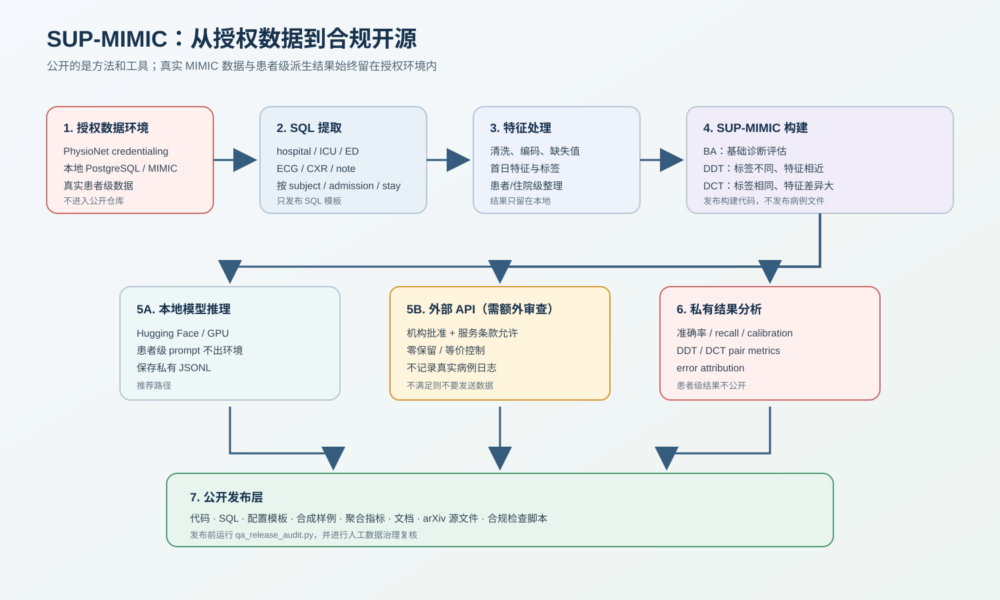
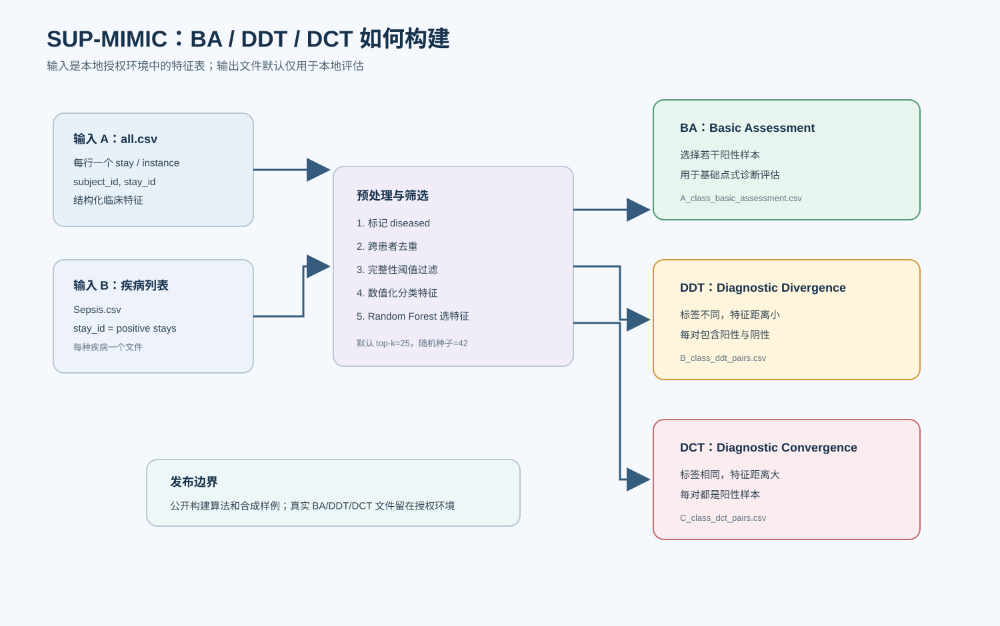
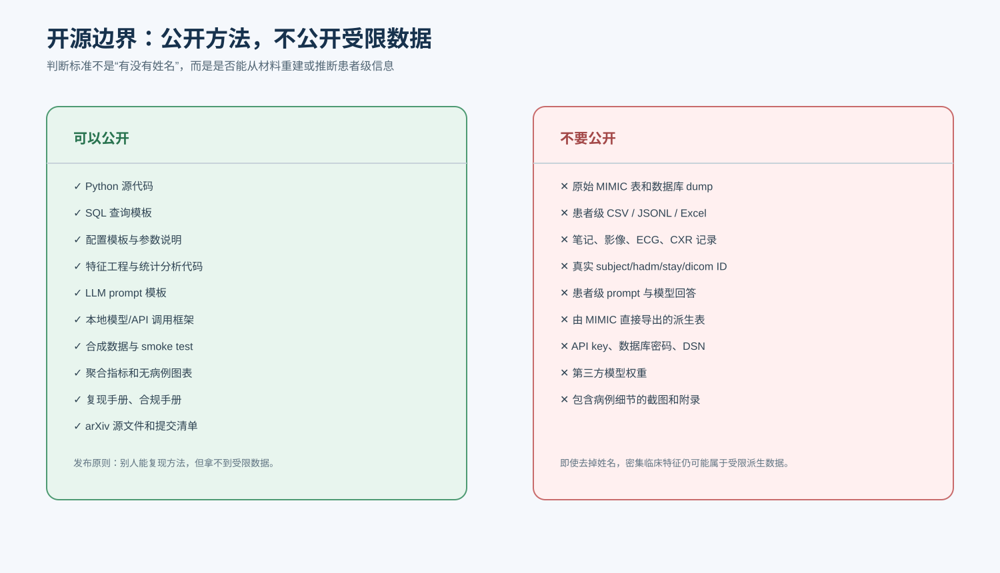
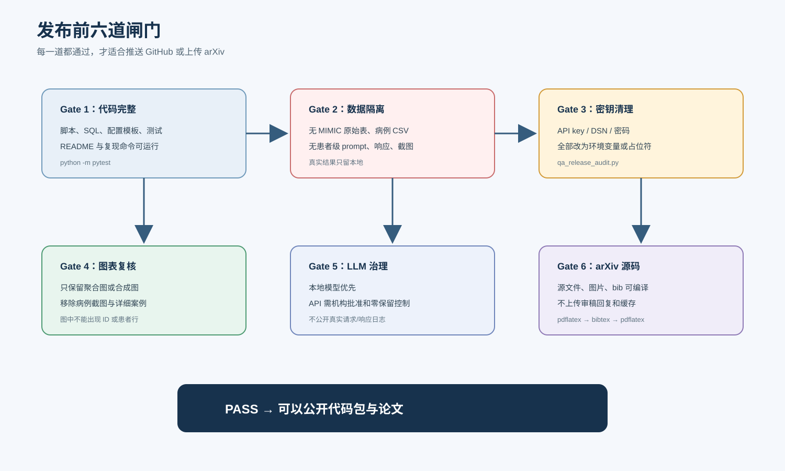

# SUP-MIMIC

**A multi-task clinical diagnosis benchmark for evaluating whether large language models remain robust when clinical evidence is similar-but-different or different-but-same.**

[Paper](arxiv/source/main.tex) · [arXiv guide](arxiv/README.md) · [Visual guide](docs/visual_guide.md) · [Reproducibility](docs/reproducibility_workflow.md) · [Compliance](docs/compliance.md) · [SQL](sql/README.md)

> SUP-MIMIC is a reproducibility-first code release. It releases the benchmark construction pipeline, SQL templates, LLM evaluation code, documentation, and synthetic examples. It does not redistribute MIMIC data or patient-level derived records.



## What Problem Does SUP-MIMIC Study?

Clinical diagnosis is not a simple one-to-one mapping from symptoms to diseases. Two patients can look clinically similar but require different diagnoses. Conversely, two patients can look very different but still share the same diagnosis. Standard single-case medical QA benchmarks often miss this failure mode because they mostly test whether a model can answer one isolated question at a time.

SUP-MIMIC asks a harder question:

**Can an LLM preserve the correct diagnostic relationship across patient pairs when surface-level clinical evidence is misleading?**

The benchmark is built from MIMIC-IV ICU records and evaluates LLMs with three complementary tasks:

| Task | Clinical situation | What the model must do | Main failure exposed |
|---|---|---|---|
| **BA** | One patient, one candidate disease | Decide whether the disease is present | Basic diagnostic verification |
| **DDT** | Two clinically similar patients, different labels | Accept the diagnosis for the positive case and reject it for the hard negative | Over-reliance on surface similarity |
| **DCT** | Two clinically different patients, same positive label | Accept the diagnosis for both patients despite heterogeneous presentations | Missed atypical cases |



## Paper In One Minute

**Motivation.** Existing LLM medical evaluations often emphasize factual knowledge recall or isolated diagnosis. Real clinical reasoning also requires robustness to contradictory evidence, comorbidity interference, and atypical presentations.

**Method.** SUP-MIMIC converts multi-label ICU records into binary patient-diagnosis verification tasks. For each anchor disease, it ranks diagnosis-informative structured features, estimates patient similarity in that disease-specific feature space, and mines naturally occurring adversarial pairs from real ICU records.

**Benchmark.** The paper evaluates **13 contemporary LLMs** across **BA, DDT, and DCT**, with pair-aware metrics that require both members of a pair to be classified correctly.

**Main finding.** Strong single-case performance does not guarantee pairwise diagnostic robustness. Models often show a healthy-prediction bias and fail to integrate multiple pieces of evidence when the case is atypical or contrastive.


## Core Contributions

1. **A pairwise clinical diagnosis benchmark.** SUP-MIMIC formalizes two robustness settings that standard pointwise diagnosis misses: diagnostic divergence and diagnostic convergence.
2. **A reproducible adversarial pair mining pipeline.** The construction method combines supervised feature ranking, disease-specific similarity estimation, and controlled pair selection.
3. **Pair-aware evaluation metrics.** DDT and DCT are evaluated not only by per-case accuracy but also by whether the model preserves the diagnostic relationship within a pair.
4. **A broad LLM evaluation.** The paper compares open-source general LLMs, open-source medical LLMs, and closed-source general LLMs.
5. **A compliance-conscious release.** The public repository contains code, SQL, documentation, and synthetic examples while keeping restricted MIMIC-derived patient-level artifacts out of GitHub.

## Method Overview

SUP-MIMIC starts from authorized local MIMIC-IV data and produces private benchmark cases through the following stages:

| Stage | Input | Operation | Output |
|---|---|---|---|
| 1. Cohort definition | MIMIC-IV ICU records | Select adult ICU stays and candidate diagnoses | Local cohort table |
| 2. Feature extraction | SQL templates | Extract first-24-hour vitals, labs, scores, diagnoses, and related structured variables | Local feature table |
| 3. Disease filtering | ICD-coded diagnoses | Remove overly broad, rare, incomplete, or unstable labels | Anchor disease set |
| 4. Feature ranking | Positive/negative cases per disease | Train disease-specific Random Forest models | Top diagnostic features |
| 5. Similarity mining | Disease-specific feature space | Compute patient distances | Similar / dissimilar candidate pairs |
| 6. Task construction | Labels + distances | Build BA, DDT, and DCT cases | Private benchmark files |
| 7. LLM evaluation | Structured prompts | Run local models or approved APIs | Private JSONL predictions |
| 8. Reporting | Private predictions | Aggregate metrics and figures | Public aggregate results |


## The Three Evaluation Tasks

### BA: Basic Assessment

BA is the ordinary single-case diagnostic verification task. The model receives one structured patient profile and one candidate disease, then predicts whether the disease is present.

```text
Patient profile + target disease -> yes / no
```

BA tells us whether the model can perform basic diagnosis, but it does not test whether the model remains consistent under contrastive evidence.

### DDT: Diagnostic Divergence Task

DDT creates hard pairs where two patients are similar in disease-relevant features but have different labels for the anchor disease.

```text
Patient A: similar profile, disease present
Patient B: similar profile, disease absent

Correct pair = A yes + B no
```

DDT tests whether a model can notice decisive differences instead of assigning the same diagnosis to superficially similar patients.

### DCT: Diagnostic Convergence Task

DCT creates pairs where two patients are clinically dissimilar but share the same diagnosis.

```text
Patient A: atypical presentation, disease present
Patient B: different presentation, disease present

Correct pair = A yes + B yes
```

DCT tests whether a model can recognize the same diagnosis across heterogeneous presentations instead of rejecting atypical cases.

## Metrics

SUP-MIMIC reports standard pointwise metrics and pair-aware robustness metrics.

| Metric | Meaning |
|---|---|
| `Acc_BA` | Accuracy on single-case basic assessment |
| `Acc_DDT` | Pointwise accuracy on DDT cases |
| `Acc_DCT` | Pointwise accuracy on DCT cases |
| `PDRA_DDT` | Pair is correct only when the positive case is accepted and the hard negative is rejected |
| `PDRA_DCT` | Pair is correct only when both positive cases are accepted |
| `ADR` | Average diagnostic robustness across BA and pairwise tasks |
| `SRS` | Composite robustness score penalizing imbalance across DDT and DCT |
| `Sick_R` | Recall for disease-present cases |
| `Healthy_R` | Recall for disease-absent cases |

The key design choice is that a pair is counted as robust only when the diagnostic relation inside the pair is preserved.

## Main Results

The paper evaluates 13 LLMs with five independent runs. A compact view of representative metrics is shown below.

| Model | Category | Acc_BA | Acc_DDT | Acc_DCT | PDRA_DDT | PDRA_DCT | SRS |
|---|---|---:|---:|---:|---:|---:|---:|
| Llama3.3-70B | Open general | 0.357 | 0.581 | 0.366 | 0.204 | 0.221 | 0.161 |
| Qwen2.5-7B | Open general | 0.299 | 0.500 | 0.312 | 0.213 | 0.293 | 0.118 |
| Qwen2.5-14B | Open general | 0.326 | 0.580 | 0.283 | 0.226 | 0.303 | 0.132 |
| Qwen2.5-32B | Open general | 0.562 | 0.616 | 0.346 | 0.269 | 0.343 | 0.257 |
| Mistral-7B | Open general | 0.264 | 0.493 | 0.156 | 0.303 | 0.280 | 0.073 |
| DeepSeek-V3 | Open general | 0.477 | 0.607 | 0.529 | 0.305 | 0.296 | 0.268 |
| GLM-4.7 | Open general | 0.256 | 0.631 | 0.349 | 0.226 | 0.253 | 0.116 |
| HuatuoGPT-o1-8B | Open medical | 0.522 | 0.602 | 0.506 | 0.334 | 0.398 | **0.287** |
| MedReason-8B | Open medical | 0.438 | 0.608 | 0.466 | 0.224 | 0.289 | 0.227 |
| GPT-3.5 | Closed general | 0.404 | 0.529 | 0.442 | 0.317 | 0.345 | 0.196 |
| GPT-4o | Closed general | 0.482 | **0.677** | 0.517 | **0.366** | 0.299 | 0.283 |
| Gemini-2.5 Flash | Closed general | 0.398 | 0.618 | 0.483 | 0.300 | 0.324 | 0.205 |
| Claude Sonnet 4.5 | Closed general | 0.265 | 0.574 | 0.406 | 0.313 | 0.282 | 0.130 |

Important pattern: the best pointwise score is not the same as the most robust pairwise behavior. HuatuoGPT-o1-8B obtains the strongest SRS, while GPT-4o leads DDT pointwise and DDT pairwise accuracy.


## Key Findings

### 1. Pointwise accuracy can hide pairwise inconsistency

Models may appear reasonable on isolated patient-diagnosis decisions while failing to classify both members of a diagnostic pair correctly. SUP-MIMIC therefore reports pair-level metrics in addition to pointwise accuracy.

### 2. Diagnostic convergence is especially difficult

DCT remains challenging because it asks models to recognize the same disease across heterogeneous presentations. This is where missed diagnoses become most visible.

### 3. Healthy-prediction bias is common

Across challenging cases, models often over-predict the absence of disease. This produces higher healthy recall than sick recall and raises concern for missed diagnoses in atypical clinical settings.

### 4. Medical pretraining helps but does not solve robustness

Medical LLMs show more uniform robustness across tasks, but even the strongest models leave substantial room for improvement in multi-evidence integration.

### 5. Scaling helps unevenly

Scaling improves BA most clearly, improves DDT moderately, and provides much weaker gains on DCT. Larger models still struggle when the correct diagnosis is supported by non-prototypical evidence.


## Failure Modes

The paper analyzes incorrect predictions with four clinically grounded failure modes.

| Failure mode | Description | Why it matters |
|---|---|---|
| Combinatorial neglect | The model sees individual clues but fails to integrate them jointly | Dominant failure mode in complex cases |
| Feature misweighting | The model assigns the wrong importance to available indicators | Leads to overconfident but wrong decisions |
| Comorbidity conflation | The model confuses the target disease with coexisting conditions | Especially harmful in ICU patients |
| Biomarker omission | The model mentions relevant biomarkers but ignores them in the final decision | Shows a gap between explanation and prediction |

Detailed patient-level error cases are not included in the public repository because dense clinical feature vectors and model rationales can be restricted derived artifacts.

## Repository Contents

```text
SUP-MIMIC-open-source/
  arxiv/                 # cleaned arXiv source-preparation area
  configs/               # safe config templates, no credentials or real IDs
  docs/                  # compliance, reproducibility, visual guide, manuals
  examples/              # synthetic examples only
  scripts/               # SUP-MIMIC construction and LLM evaluation scripts
  sql/                   # MIMIC SQL templates, no extracted data
  src/mimic_pipeline_kit # reusable extraction/feature/statistics package
  tests/                 # tests that run on synthetic data
```

## Quick Start On Synthetic Data

Install:

```bash
python -m venv .venv
. .venv/Scripts/activate  # Windows PowerShell: .venv\Scripts\Activate.ps1
pip install -e .[all,dev,llm-api]
pytest
python scripts/qa_release_audit.py .
```

Build a tiny synthetic SUP-MIMIC sample:

```bash
python scripts/build_sup_mimic_cases.py ^
  --input-dir examples/synthetic_multidisease/input ^
  --all-csv all.csv ^
  --output-dir outputs/synthetic_sup_mimic ^
  --top-k-features 8 ^
  --ba-n 2 ^
  --pair-n 2
```

Evaluate the synthetic sample with an API-compatible endpoint:

```bash
set SUP_MIMIC_API_KEY=replace-with-your-key
python scripts/llm_api_evaluation.py ^
  --root-dir outputs/synthetic_sup_mimic ^
  --save-dir outputs/synthetic_api_eval ^
  --model gpt-4o-mini ^
  --base-url https://api.openai.com/v1/chat/completions
```

## Reproducing With MIMIC-IV

Researchers must run the real-data workflow inside their own authorized MIMIC environment.

1. Obtain legitimate MIMIC access from PhysioNet and complete the required training.
2. Load MIMIC-IV into a local database you are authorized to use.
3. Copy `configs/full_example_config.yaml` to a private ignored config file.
4. Put credentials in environment variables or a private local config.
5. Run SQL extraction locally.
6. Build SUP-MIMIC cases locally.
7. Evaluate models locally or through an approved zero-retention API setting.
8. Publish only code, SQL, synthetic examples, aggregate metrics, and approved figures.



## Compliance And Data Availability

This repository is designed for methods-level reproducibility. It does not provide access to MIMIC-IV and does not redistribute MIMIC-derived patient-level data.

Public release is limited to:

- Code
- SQL templates
- Configuration templates
- Synthetic examples
- Documentation
- Aggregate metrics and figures
- arXiv source files that have been checked for patient-level material

Not released:

- Raw MIMIC data
- Real patient-level feature tables
- Patient-level prompts or model responses
- Clinical notes, imaging records, ECG records, or CXR metadata rows
- Database credentials, API keys, or institutional access material

See [docs/compliance.md](docs/compliance.md) and [docs/data_availability_statement.md](docs/data_availability_statement.md).



## arXiv Preparation

The `arxiv/source` folder contains a cleaned source-preparation area. It excludes reviewer-response drafts, build artifacts, download folders, and detailed patient-level error-case appendix material.

Before uploading:

```bash
cd arxiv/source
pdflatex -interaction=nonstopmode -halt-on-error main.tex
bibtex main
pdflatex -interaction=nonstopmode -halt-on-error main.tex
pdflatex -interaction=nonstopmode -halt-on-error main.tex
```

Then check:

- author names, affiliations, and emails are final
- figures are aggregate or synthetic
- data availability statement points to PhysioNet rather than redistributing data
- no patient-level appendix examples are accidentally included

## Project Status

| Component | Status |
|---|---|
| SQL templates | Included |
| Python extraction and feature utilities | Included |
| SUP-MIMIC BA/DDT/DCT construction script | Included |
| Local Hugging Face evaluation script | Included |
| API-compatible evaluation script | Included |
| Error attribution scaffold | Included |
| Synthetic examples | Included |
| Real MIMIC data | Not included |
| Real patient-level benchmark files | Not included |
| arXiv source-preparation folder | Included |
| Release audit script | Included |

## Citation

```bibtex
@misc{supmimic2026,
  title = {SUP-MIMIC: A Multi-Task Clinical Diagnosis Benchmark for Evaluating LLMs' Robustness to Contradictory Evidence},
  author = {SUP-MIMIC Contributors},
  year = {2026},
  note = {Code and reproduction kit},
  url = {https://github.com/EileenYYY/SUP-MIMIC}
}
```

## License

Code and documentation in this repository are released under the MIT License. This license applies only to the repository contents. It does not grant access to MIMIC, redistribute MIMIC, or override any PhysioNet/MIMIC data-use agreement.
