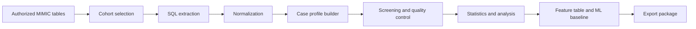

# Pipeline Overview

SUP-MIMIC 的公开代码把完整流程分成 8 层。

## 1. Cohort Selection

这一层决定进入后续处理的住院与 ICU 记录。输出是 cohort list 和候选 ID 集合。

## 2. SQL Extraction

每个 SQL 文件对应一个主题。公开仓库保留模板，不包含真实查询结果。

## 3. Normalization

各主题输出统一为稳定字段，例如 `subject_id`、`hadm_id`、`stay_id`、`item_code`、`item_name`、`value`、`unit`、`charttime` 和 `source_table`。

## 4. Case Profile Builder

这一层把多表结果组合为一个病例对象，供统计、建模和任务构建使用。

## 5. Screening and Quality Control

这一层检查年龄、住院轨迹、缺失字段、重复主键和时间字段一致性。

## 6. Statistics and Analysis

这一层生成描述性统计、分组比较、一致性分析和纵向汇总结果。

## 7. Feature Table and ML Baseline

这一层生成建模特征表，并训练基础分类器或其他基线模型。

## 8. Export Package

这一层输出公开材料、合成样例、文档和聚合指标。患者级结果保留在授权环境。
