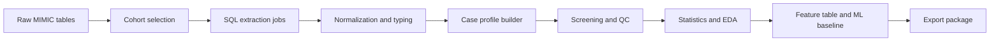

# Pipeline Overview

这个框架把 MIMIC 数据处理拆成 8 层。

## 1. Cohort selection

先决定“哪些患者要进管线”。

常见条件：

- 年龄阈值
- 是否有 ICU stay
- admission 次数
- 是否有完整诊断 / 处方 / 实验室记录
- 排除 newborn / 低质量轨迹

这一层建议只产出 cohort list，不做复杂联表。

## 2. SQL extraction

每个数据主题一个 SQL 文件。

推荐主题：

- demographics
- admissions
- icustays
- labs
- vitals
- diagnoses
- procedures
- medications
- notes

每个 SQL 文件最好只做一件事，避免巨型脚本。

## 3. Normalization

把不同表的输出统一成稳定 schema。

建议统一字段：

- `subject_id`
- `hadm_id`
- `stay_id`
- `item_code`
- `item_name`
- `value`
- `unit`
- `charttime`
- `source_table`

## 4. Case profile builder

把多张表合成一个病例对象。

建议保留：

- 患者基本信息
- 住院列表
- ICU stay 列表
- 首日 labs
- 首日 vitals
- 诊断列表
- procedure 列表
- medication 列表

## 5. Screening and QC

在导出前再过一层规则，避免脏样本进入下游。

建议检查：

- 年龄是否满足
- 是否缺少关键表
- 是否出现空轨迹
- 是否存在重复主键
- 时间字段是否单调

## 6. Export

输出建议分三类：

- raw exports
- case profiles
- screened cohorts

每一次导出都写 manifest，记录：

- 时间
- 输入配置
- job 名称
- 行数
- 生成路径

## 7. Statistics

这一层对应：

- 描述性统计
- 分组比较
- 一致性分析
- 纵向与重复测量
- 因果推断前的数据准备

## 8. ML baseline

这一层对应：

- feature table
- train / validation / test split
- baseline model
- metrics report
- model artifact export
